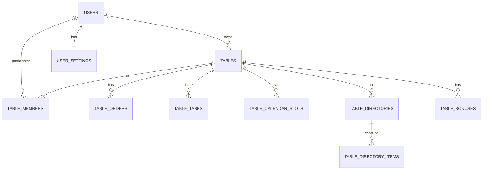
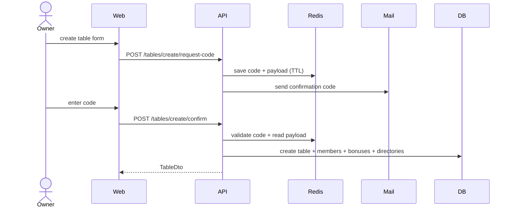
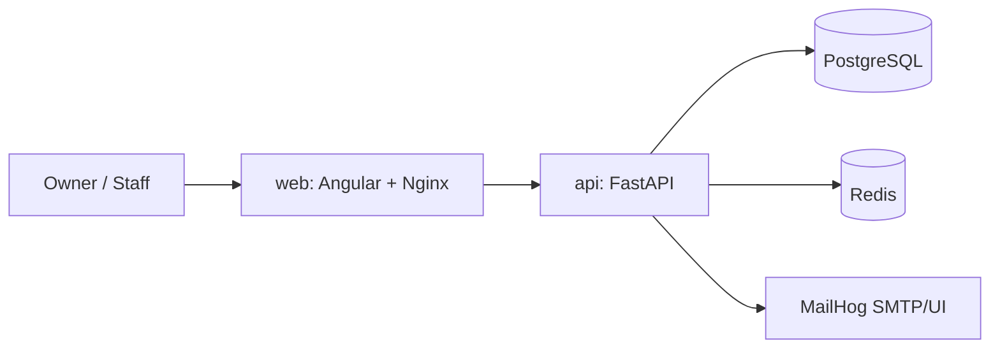

# SmartWork

SmartWork — веб-платформа для малого сервиса с моделью «владелец -> сотрудники -> столы (рабочие контуры)». Каждый стол изолирует рабочие данные: календарь, задачи, заказы, справочники, аналитику и настройки.

README ниже оформлен как техническая точка входа для разработки, расширения архитектуры и подготовки проектных диаграмм.

## 1) Назначение и границы системы

Проект решает задачу операционного управления малым сервисом (барбершоп, груминг и другие сценарии через `custom`-preset):
- владелец создает и настраивает столы;
- назначает сотрудников на конкретные столы;
- ведет процессы в разрезе каждого стола;
- использует справочники и аналитику для операционных решений.

Система включает:
- `frontend` (Angular SPA);
- `backend` (FastAPI API + бизнес-логика);
- `PostgreSQL` (основные данные);
- `Redis` (коды подтверждения, временные токены и lock/cooldown механики);
- `MailHog` (dev SMTP и просмотр писем);
- контейнеризацию через `docker-compose.yml`.

## 2) Технологический стек

| Слой | Технологии |
|------|------------|
| Клиент | Angular 19, standalone-компоненты, lazy routes, PrimeNG |
| API | FastAPI, Pydantic, JWT, CORS |
| Данные | PostgreSQL 16, SQLAlchemy 2 Async ORM |
| Быстрое хранилище | Redis 7 |
| Почта | MailHog (dev), SMTP |
| Инфраструктура | Docker Compose, отдельные Dockerfile для `api`, `web`, `mail` |

## 3) Структура репозитория

```text
SmartWork/
├── frontend/                 # Angular SPA (auth, dashboard, workspace, status)
├── backend/                  # FastAPI (routers, models, schemas, services, core, db)
├── database/                 # init-скрипты БД для docker entrypoint
├── mail/                     # Dockerfile для почтового dev-сервиса
├── docker-compose.yml        # локальная оркестрация
├── .env.example              # пример переменных окружения
├── CONNECTIONS_GUIDE.md      # памятка URL и подключений
└── README.md
```

## 4) Модульная архитектура backend

Точка входа API: `backend/app/main.py`.

### Слои backend

- `backend/app/routers`  
  HTTP-слой: валидация входа, авторизация, orchestration use-cases.
- `backend/app/schemas`  
  Контракты DTO (запрос/ответ) для роутеров.
- `backend/app/models`  
  ORM-сущности домена и связей.
- `backend/app/services`  
  Повторно используемая бизнес-логика (`analytics`, `directory_bootstrap`, `email_sender`, `connectivity`).
- `backend/app/core`  
  Конфигурация (`config.py`) и безопасность (`security.py`).
- `backend/app/db`  
  `Base`, `engine`, `AsyncSession`, dependency `get_db`.
- `backend/alembic`  
  Конфиг миграций; ревизии пока не зафиксированы в `versions`.

### Роутеры и зона ответственности

- `backend/app/routers/auth.py`  
  Регистрация с кодом подтверждения, логин, `me`, forgot/reset password, `get_current_user`.
- `backend/app/routers/tables.py`  
  Создание/удаление стола по email-коду, список столов, участники, подписки/бонусы, агрегированная статистика.
- `backend/app/routers/table_workspace.py`  
  Операции в контуре одного стола: календарь, задачи, справочники, аналитика, настройки.
- `backend/app/routers/employees.py`  
  Управление сотрудниками владельца, приглашения и привязка к столам.
- `backend/app/routers/settings.py`  
  Персональные настройки пользователя.
- `backend/app/routers/system.py`  
  Системные проверки готовности зависимостей.

## 5) Доменная модель и связи сущностей

Основные модели находятся в `backend/app/models`.

- `User` (`users`)  
  Роли: `owner`/`staff`, профиль, `owner_id` для подчиненности сотрудника владельцу.
- `Table` (`tables`)  
  Рабочий контур владельца; поля preset и настройки рабочего режима.
- `TableMember` (`table_members`)  
  Связь M:N между пользователем и столом (кроме ownership).
- `TableOrder` (`table_orders`)  
  Заказы и их статусы в столе.
- `TableTask` (`table_tasks`)  
  Задачи стола с assignee и статусами.
- `TableCalendarSlot` (`table_calendar_slots`)  
  Календарные слоты.
- `TableDirectory`, `TableDirectoryItem`  
  Справочники и карточки со структурированным `payload` (JSONB).
- `TableBonus`  
  Флаги/квоты функциональности стола (`unlock_analytics`, `extra_directories` и др.).
- `UserSettings`  
  Персональные настройки UI и уведомлений.

Кардинальности (концептуально):
- `User(owner)` 1:N `Table`
- `User` M:N `Table` через `TableMember`
- `Table` 1:N `Order`, `Task`, `CalendarSlot`, `Directory`, `Bonus`
- `TableDirectory` 1:N `TableDirectoryItem`

## 6) Ключевые бизнес-сценарии

### 6.1 Регистрация и вход

1. Пользователь отправляет `register/request-code`.
2. Backend создает/обновляет неактивного `User`, генерирует код, сохраняет в Redis.
3. Код отправляется по SMTP.
4. `register/confirm` проверяет код и активирует пользователя.
5. Возвращается JWT access token.

Особенности:
- cooldown отправки и лимиты запросов кода в час;
- лимит неуспешных проверок кода и временный lock;
- пароли хэшируются через bcrypt.

### 6.2 Создание стола

1. Владелец вызывает `tables/create/request-code`.
2. В Redis сохраняются код + payload создания.
3. `tables/create/confirm` валидирует код.
4. Создается `Table`, бонусы, участники, seed справочников по preset.

Особенности:
- bootstrap справочников идет через `services/directory_bootstrap.py`;
- правила preset и alias находятся в `app/config/directory_presets.py`.

### 6.3 Приглашение сотрудника

1. Владелец формирует приглашение в роутере `employees`.
2. Код/привязка сохраняются в Redis.
3. Сотрудник завершает регистрацию по invite-сценарию.
4. Backend проставляет `owner_id` и членство в `TableMember`.

### 6.4 Работа внутри стола

`table_workspace` предоставляет вкладки: календарь, задачи, сотрудники, справочники, аналитика, настройки.  
Доступ проверяется на уровне владельца или участника стола.

## 7) Frontend архитектура

Точка маршрутизации: `frontend/src/app/app.routes.ts`.

- страницы авторизации: `pages/auth/*`;
- панель управления: `pages/dashboard/*`;
- рабочее пространство стола: `pages/table-workspace/*` с дочерними lazy routes;
- guard: `core/auth/auth.guard`;
- API-клиент/состояние auth: `core/auth/auth.service.ts`.

Маршруты `workspace/table/:tableId/*` разбиты по вкладкам и грузятся лениво.

## 8) Инфраструктура и конфигурация

### Переменные окружения

Базовые ключи в `.env.example`:
- `DATABASE_URL`, `REDIS_URL`;
- `JWT_SECRET_KEY`, `JWT_ALGORITHM`;
- `SMTP_HOST`, `SMTP_PORT`, `EMAIL_FROM`;
- `CORS_ORIGINS`, `API_V1_PREFIX`;
- `ENABLE_DEV_SEED_STAFF` и dev-параметры тестового сотрудника.

### Docker Compose

`docker-compose.yml` поднимает сервисы:
- `db` (PostgreSQL);
- `redis`;
- `mail` (MailHog);
- `api` (FastAPI);
- `web` (Nginx + собранный Angular).

### База и миграции

- схема управляется через Alembic-миграции из `backend/alembic/versions`;
- при запуске backend-контейнера выполняется `alembic upgrade head`.

## 9) API и точки проверки

- OpenAPI JSON: `/openapi.json`
- Swagger UI: `/docs`
- ReDoc: `/redoc`
- Health-check: `/health`

Локальные URL и порты см. в `CONNECTIONS_GUIDE.md`.

## 10) Текущие архитектурные решения и последствия

1. Прямой доступ роутеров к ORM (без отдельного repository-слоя) ускоряет разработку, но усложняет масштабирование логики.
2. Redis используется как временное хранилище кодов/токенов — хорошо для UX и безопасности, требует контроля TTL/очистки.
3. JSONB `payload` в справочниках дает гибкость предметных карточек, но требует схемной дисциплины на уровне API.
4. Ограничения функционала через `TableBonus` позволяют внедрять product gating без переработки модели таблиц.
5. Контроль схемы через Alembic дает воспроизводимость окружений и предсказуемый деплой.

## 11) README как база для диаграмм

Ниже перечень диаграмм, которые рекомендуется поддерживать в `docs/diagrams`.

### 11.1 C4 System Context

Показывает акторов и внешние зависимости:
- владелец;
- сотрудник;
- SmartWork (Web + API);
- SMTP/MailHog;
- PostgreSQL;
- Redis.

### 11.2 C4 Container

Контейнерный уровень:
- `web` (Angular SPA + Nginx);
- `api` (FastAPI);
- `db` (PostgreSQL);
- `redis`;
- `mail`.

### 11.3 C4 Component (API)

Компоненты внутри `api`:
- routers;
- services;
- models/schemas;
- core security/config;
- db/session layer.

### 11.4 ER Diagram

Обязательные сущности:
`users`, `tables`, `table_members`, `table_orders`, `table_tasks`, `table_calendar_slots`, `table_directories`, `table_directory_items`, `table_bonuses`, `user_settings`.

### 11.5 Sequence Diagrams

Минимальный набор сценариев:
1. Регистрация с подтверждением кода.
2. Создание стола через двойное подтверждение.
3. Invite сотрудника и привязка к столу.
4. Загрузка workspace и проверка прав доступа.
5. Восстановление пароля.

### 11.6 Deployment Diagram

Отразить:
- сеть между контейнерами;
- внешние порты;
- volumes;
- env/secrets точки;
- healthchecks и зависимости старта.

## 12) Шаблоны для быстрого построения диаграмм (Mermaid)

### 12.1 ERD шаблон



### 12.2 Sequence шаблон (создание стола)



### 12.3 Container шаблон



## 13) Запуск

### Полностью в Docker

1. Создать `.env` на основе `.env.example`.
2. Выполнить:
   - `docker compose up -d --build`
3. Проверить:
   - web: `http://localhost`
   - api docs: `http://localhost:8000/docs`
   - mailhog: `http://localhost:8025`

### Локальная разработка frontend

В `frontend`:
- `npm install`
- `npm start`

### Локальная разработка backend

В `backend`:
- создать venv;
- `pip install -r requirements.txt`;
- настроить env (`DATABASE_URL`, `REDIS_URL`, `JWT_SECRET_KEY`);
- `uvicorn app.main:app --reload`.

## 14) Приоритеты следующего этапа

1. Зафиксировать миграционную стратегию через полноценные Alembic revision-файлы.
2. Вынести общую бизнес-логику из роутеров в сервисный/use-case слой.
3. Ввести единый каталог `docs/diagrams` и поддерживать диаграммы вместе с кодом.
4. Добавить архитектурные ADR для ключевых решений (Redis-коды, JSONB payload, бонусная модель).
5. Формализовать мониторинг ошибок API и доставку писем.
